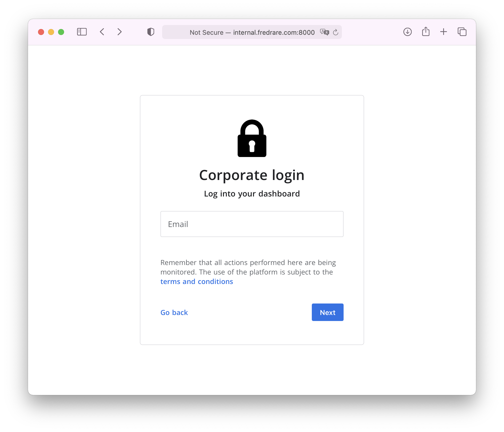
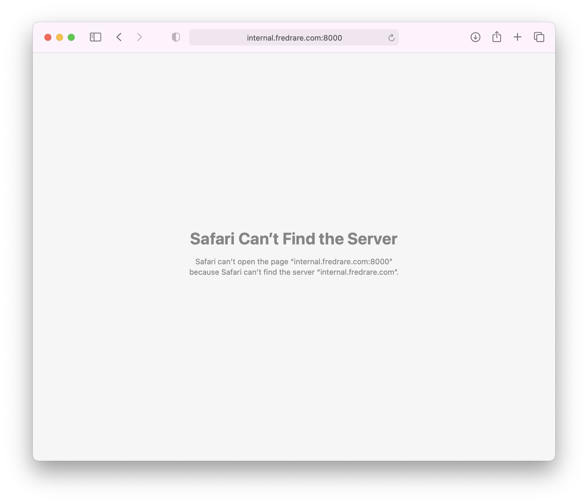
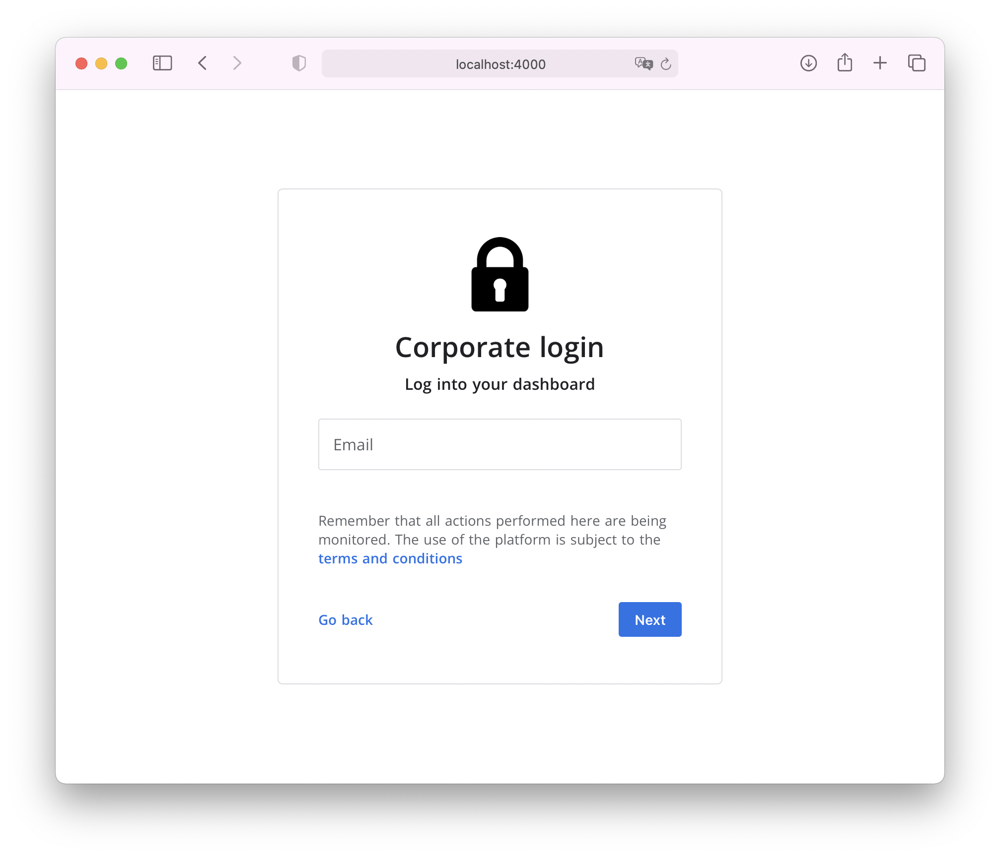

## Introducción
*Nota: Este post debería verse como una continuación del anterior, que puedes leer [aquí](../ssh-mas-seguro).*

En esta continuación de la serie de artículos sobre ssh, veremos una de las capacidades más útiles de ssh: la posibilidad de crear túneles de conexión. Veamos un caso hipotético:

Tengo un servidor web (`internal.fredrare.com`) en mi casa de campo. Ese servidor solo acepta conexiones entrantes desde dentro de la red de esa casa. En esa misma casa de campo, tengo un servidor ssh (`edge.fredrare.com`) que me permite administrar y acceder a dicha red.

Actualmente, estoy en mi departamento en la ciudad y quiero entrar a `internal.fredrare.com`, pero solo puedo conectarme por ssh con `edge.fredrare.com`. ¿Cómo podría acceder a la página web interna?

Usaremos ssh para resolver el problema de una forma bastante sencilla.

## Configuración actual
`internal.fredrare.com` tiene un servicio en el puerto `8000`: una página corporativa protegida por contraseña. Entonces, si estoy en la red local, puedo ver algo como esto:



Evidentemente, puedo resolver el dominio en la red interna y, además, puedo acceder al sitio. Ahora intentaré hacerlo desde la laptop que tengo en mi departamento.



Razonablemente, no puedo acceder, porque no estoy dentro de la red interna. No puedo resolver el dominio y, aunque pudiera, no podría comunicarme. No obstante, sí puedo acceder al servidor por ssh.

```bash
$ ssh anti@edge.fredrare.com
anti@edge.fredrare.com [~] $ 
```

Con esto en mente, puedo crear un túnel ssh para acceder a los recursos internos a los que sí tiene acceso el *host* remoto (`edge.fredrare.com`).

## Túnel ssh
Un túnel ssh permite proteger una conexión y montarla sobre el canal seguro que nos proporciona ssh. De esta manera, es posible:
1. Tener tráfico encriptado en canales inseguros en aplicaciones que no lo soportan por defecto
2. Cifrar los mensajes de forma que no puedan ser analizados por algún sistema de monitoreo
3. Acceder a aplicaciones inaccesibles desde fuera de una red, como si usáramos un reverse proxy.
4. Hacer pivoting entre varios servidores ssh para navegar por los recursos de una red protegida desde fuera.
5. Muchas cosas más 😂

Hoy nos interesa la 3.

### Creación del túnel
Con el siguiente comando podemos abrir el túnel:

```bash
$ ssh -L 4000:internal.fredrare.com:8000 anti@edge.fredrare.com
anti@edge.fredrare.com [~] $ 
```

Aparentemente, el resultado parece haber sido el mismo: he obtenido una *shell* en `edge.fredrare.com`, como en el ejemplo anterior. No obstante, el comando es más complejo esta vez. Lo desglosaré a continuación:

1. `ssh` es el programa que vamos a usar para poder establecer la conexión.
2. `-L` permite hacer un túnel local. Esto significa que se podrá acceder a un recurso desde el dispositivo local (la computadora que estoy usando para establecer la conexión).
3. `4000` es el puerto local que se abrirá para poder establecer la conexión que pasará dentro del túnel.
4. `internal.fredrare.com` es el host al que deberá redirigirnos `edge.fredrare.com`. El ***fqdn*** (nombre del *host*, básicamente) que pondremos aquí será resuelto por `edge.fredrare.com`, así que, si usáramos `localhost`, por ejemplo, llegaríamos al mismo `edge.fredrare.com`, porque se resolvería el nombre dentro de la misma máquina.
5. `8000` es el puerto por el que queremos acceder al host que especificamos. Así que estaremos entrando realmente a `internal.fredrare.com:8000`, justo lo que estábamos buscando.
6. `anti` es el usuario con el que estamos ingresando al servidor ssh (`edge.fredrare.com`) por el puerto `22`, que es el puerto por defecto para ssh.
7. `edge.fredrare.com` es el host por el que estamos abriendo el túnel. Todo el tráfico pasará encriptado gracias al túnel entre mi máquina y `edge.fredrare.com`.

De esta manera, el flujo resumido sería el siguiente:

> Abriré un túnel seguro entre mi pc y `edge.fredrare.com`. A través de este túnel seguro pasará todo el tráfico que llegue a mi pc por el puerto `4000` y `edge.fredrare.com` se encargará de mandar ese mismo tráfico hacia `internal.fredrare.com` por el puerto `8000`. Así podré acceder a una web con la que no puedo comunicarme directamente.

### Comprobación de puertos
Si el comando ha sido exitosamente ejecutado, el puerto `4000` se debería haber abierto en mi máquina local. Lo puedo comprobar con `netstat -tulpn | grep LISTEN` en Linux o en mi caso, con macOS, de la siguiente forma:

```bash
$ netstat -Waltn | grep LISTEN
tcp4       0      0  127.0.0.1.4000         *.*                    LISTEN     
tcp6       0      0  ::1.4000                                      *.*                                           LISTEN
```

Puedo ver que mi puerto loca `4000`, en efecto, está abierto ahora.

### Prueba de acceso
Ahora que sé que mi puerto local está abierto, puedo intentar conectarme a él y, si `edge.fredrare.com` tiene acceso a `internal.fredrare.com`, como debería, podré acceder a la página interna sin problemas. Entraré a Safari para comprobar que sea así.



¡Éxito! He logrado acceder a un recurso que era inaccesible para mí. He usado ssh como canal seguro de comunicación y esto me ha permitido acceder a un *endpoint* protegido.

Si te gustó, considera unirte a mi servidor en Discord para aprender más. Lo puedes encontrar al final de la página. Bye.