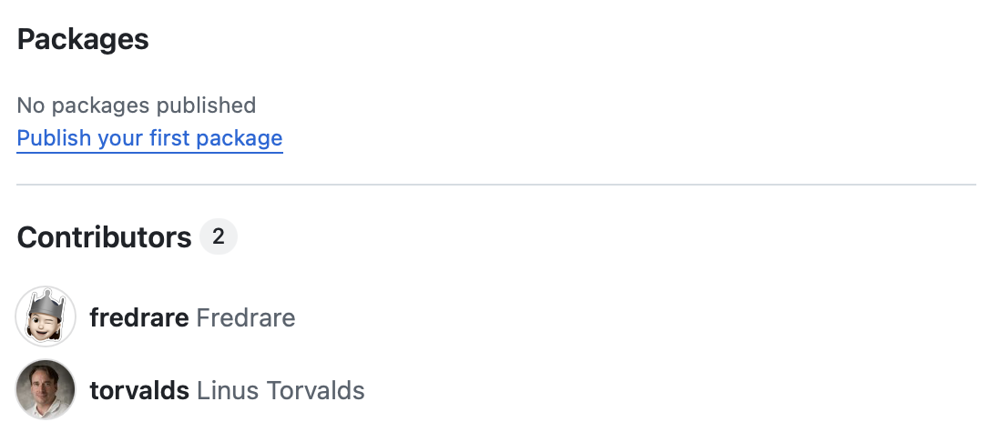
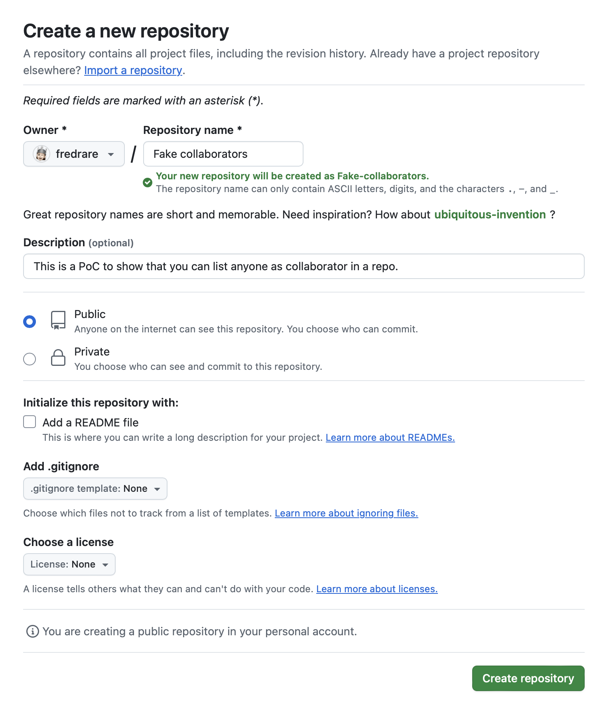
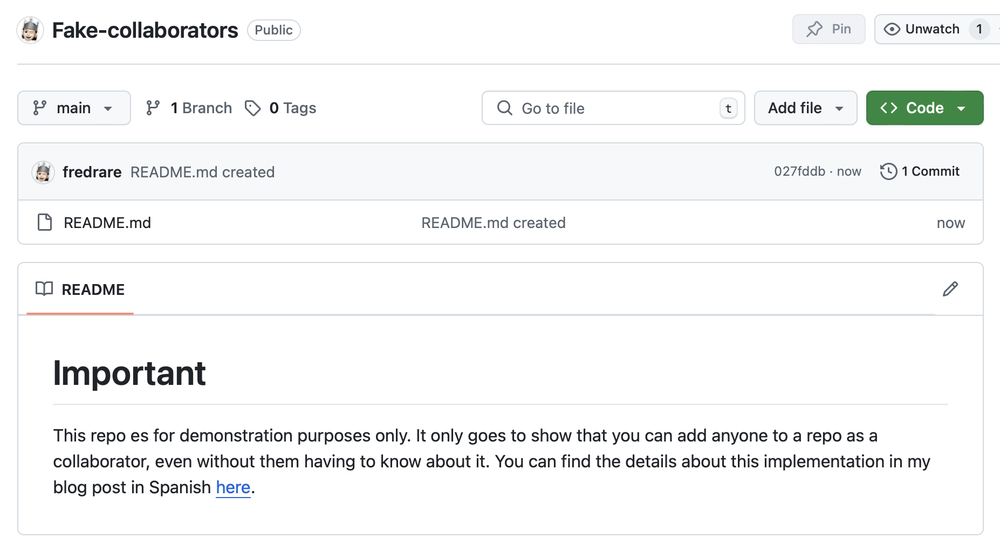
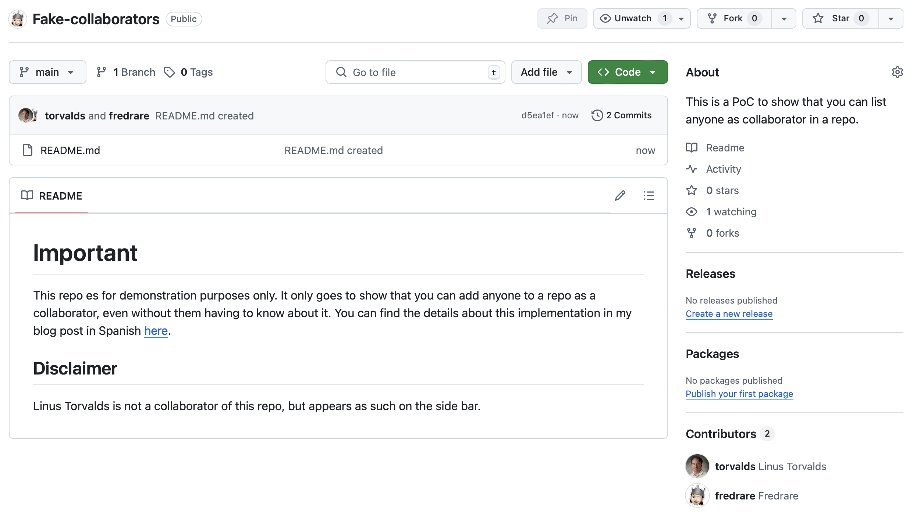
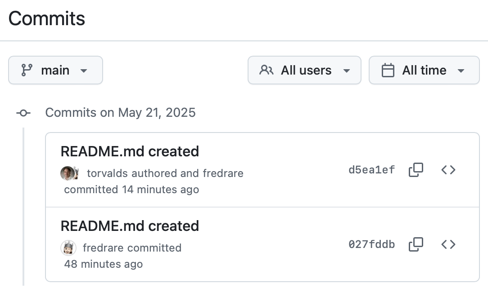
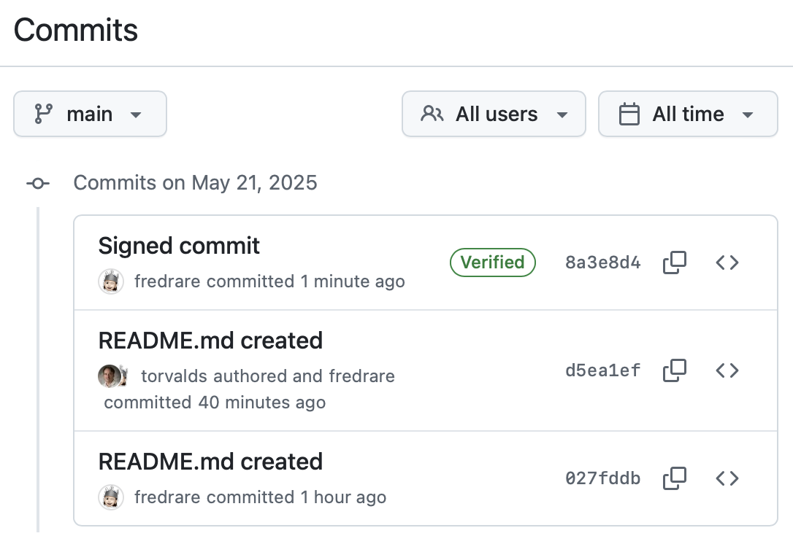

## Introducción
Es posible hacer que cualquier usuario de [GitHub](https://github.com) aparezca como "colaborador" de un repositorio. En este artículo, haré que [Linus Torvalds](https://en.wikipedia.org/wiki/Linus_Torvalds) sea colaborador de un [repositorio random que crearé](https://github.com/fredrare/Fake-collaborators). Colocaré un *disclaimer* en el repositorio que indicará que es una prueba de concepto y realmente Linus no tiene ningún tipo de afiliación con el proyecto, para evitar cualquier problema legal. En la siguiente imagen, se puede ver lo que lograremos con este ejercicio.


Quiero resaltar, antes de iniciar, que esta no es una falla real de GitHub, ni `git` en general. Por el contrario, por diseño, `git` permite definir el autor de un *commit* manualmente, por cuestiones de usabilidad. No obstante, es posible tener certeza de que una persona sí ha hecho un *commit* de forma intencional a través de *commits* firmados. Por lo tanto, también mostraré cómo se pueden diferenciar ambos casos y cómo implementar la firma de *commits* en un ambiente local.

El proceso será el siguiente:
1. Crear el repositorio con un `README.md` básico
2. Lanzar un *commit* con mi usuario
3. Hacer una modificación en el `README.md`
4. Lanzar un *commit* como Linus
5. Configurar la firma de commits en mi máquina
6. Lanzar un *commit* firmado por mí
7. Interpretar el resultado en GitHub

## Proceso
### Crear el repositorio con un `README.md` básico
Realmente, no es necesario tener un repositorio configurado de una forma complicada para poder hacer esto. Solo crearé un repositorio y le colocaré un archivo `README.md`, con un texto básico que explica la situación.


Ahora, clonaré el repositorio en mi máquina para poder hacer las pruebas.
```bash
git clone https://github.com/fredrare/Fake-collaborators.git
```

### Lanzar un *commit* con mi usuario
Ahora crearé el `README.md` con el siguiente contenido:
```md
# Important
This repo es for demonstration purposes only. It only goes to show that you can add anyone to a repo as a collaborator, even without them having to know about it. You can find the details about this implementation in my blog post in Spanish [here](https://fredrare.com/post/aparentemente-hackeando-github/).
```

Ahora solo me toca hacer un *commit* normal y el primer paso está listo.
```bash
git add .
git commit -m "README.md created"
# Aprovecho para hacer push a GitHub para ver los cambios
git push origin main
```

Y todo en GitHub, como siempre. Este es un *commit* estándar, sin nada especial, como los que podríamos encontrar en cualquier repositorio.


### Hacer una modificación en el `README.md`
Ahora colocaré una sección extra en el `README.md` y mencionaré que Linus Torvalds no es un colaborador del repo.
```md
## Disclaimer
Linus Torvalds is not a collaborator of this repo, but appears as such on the side bar.
```

### Hacer un *commit* como Linus
Solo necesitamos agregar un parámetro al comando de *commit* para poder impersonar a Linus. Pondré `--author` seguido de cierta información del autor. No publicaré su correo, pese a que es público. Si lo quieren, búsquenlo 💀
```bash
git add .
git commit -m "README.md created" --author "Linus Torvalds <linus@example.com>"
# Aprovecho para hacer push a GitHub para ver los cambios
git push origin main
```

Podemos ver que ahora Linus aparece como un colaborador 100% real.


Ahora, veamos con un poco más de detalle qué nos dice GitHub al respecto.


Podemos ver claramente que GitHub indica que Linus fue el autor y que yo hice el *commit*. Esto ya debería indicarnos que ver a un colaborador de esa manera en un repositorio **no indica** que realmente haya sido el autor de nada. No obstante, en la *graaaaaaaan* mayoría de casos, los colaboradores sí son reales. Pero entendamos que ese mensaje realmente no nos da **certeza**.

### Configurar la firma de *commits* en mi máquina
Dado que para hacer push desde mi máquina requiero haber configurado mi llave SSH previamente en GitHub, solo usaré la misma para poder firmar mis *commits*.
```bash
git config --global gpg.format ssh
git config --global user.signingkey ~/.ssh/id_rsa.pub
```

Pueden revisar más detalles sobre cómo configurar su llave en GitHub en la [documentación oficial](https://docs.github.com/en/authentication/managing-commit-signature-verification/telling-git-about-your-signing-key).

Ahora que git se ha enterado de la existencia de mi llave SSH, solo me queda configurar que todos mis *commits* se firmen automáticamente con ella.
```bash
git config --global commit.gpgsign true
```

### Lanzar un *commit* firmado por mí
He agregado algo de texto al `README.md` para poder hacer un *commit*. Ahora, podré hacer el proceso con normalidad, dado que los *commits* serán firmados por *default*.
```bash
git add .
git commit -m "Signed commit"
# Aprovecho para hacer push a GitHub para ver los cambios
git push origin main
```


Ahora, podemos ver que se muestra la palabra **Verified** junto al *commit*, dado que la firma con mi llave SSH privada coincide con la llave pública que tengo configurada en mi cuenta de GitHub. Evidentemente, no podría hacer eso con la llave de Linus, dado que no tengo acceso a ella y la [computación cuántica](https://en.wikipedia.org/wiki/Quantum_computing) aún no ha avanzado lo suficiente como para poder generar una equivalente de forma arbitraria.

## Conclusión
Si quieren tener un flujo de desarrollo más seguro y robusto, hacer que los miembros de tu equipo firmen sus *commits* por *default* es una muy buena idea.

¡Hasta la próxima!