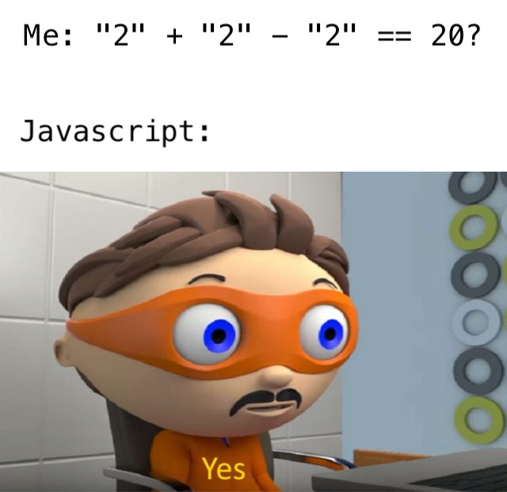

## Introducción
Sabemos muy bien que Javascript es un lenguaje muy importante. Es, a la fecha, básicamente imprescindible para programar una web app. Además, resulta una herramienta muy importante en el arsenal de cualquier persona que se dedique al *pentesting* aplicado a la web.

No obstante, su sintaxis, diseño y funcionamiento resultan ser un poco frustrantes para muchas personas, mientras que muy atractivas para otras. Así, podemos decir que este peculiar lenguaje que tiene un poco de todo, tiene a la red separada en *haters* y *lovers*.

Sin importar con qué bando te identifiques, hay algunos comportamientos interesantes que no está de más conocer sobre Javascript. Son datos que te pueden salvar de horas de *debugging* en el futuro o te pueden hacer destacar como **CRACK** en determinados contextos. Así, sin más, vamo’ a darle.

## La igualdad de objetos
### Problema
Veamos este interesante fenómeno. Cuando queremos comparar dos `objects` vacíos (dos `[]` o `{}`), obtendremos una desigualdad de la siguiente manera:

```javascript
> [] == []
false
> {} == {}
false
```

Aparentemente, puede no resultar en lo absoluto intuitivo, pero tiene una explicación de lo más lógica.

### Explicación
Cuando instanciamos un `object` en Javascript, se crea una referencia a ese objeto en la memoria. Esa referencia es la que el intérprete usará para referirse al objeto en adelante. Entonces, cuando ponemos simplemente `[] == []`, estamos creando dos referencias a objetos totalmente distintos en la memoria. El operador de igualdad verifica que se trata de dos objetos distintos y simplemente retorna `false`.

Si esto aun no se ve del todo claro, podemos ponerlo de una manera más práctica. Imaginemos que tenemos un archivo `archivo.txt` y lo copiamos a `archivo2.txt`. Podemos saber que el contenido es el mismo, porque hemos copiado el archivo, pero sabemos que, si editamos uno de ellos, el otro no se verá afectado. Y sabemos muy bien que la razón es simple: no son el mismo archivo.

Entonces, el resumen de esta explicación es que cada objeto, por más que se vea exactamente igual al otro, es una entidad totalmente distinta en la memoria para el intérprete.

## El ordenamiento automático
### Problema
Si tenemos una lista como esta `[1, 30, 4, 20, 5]` y queremos usar el método `sort` que muy amablemente nos provee Javascript nos topamos con la siguiente sorpresa.

```javascript
> [1, 30, 4, 20, 5].sort()
[1, 20, 30, 4, 5]
```

**¿Pero qué me dices?** ¿Cómo va a ser posible eso? ¿Que acaso no ves que los números siguen desordenados?

### Explicación
Si nos fijamos en la [documentación de Javascript](https://developer.mozilla.org/en-US/docs/Web/JavaScript/Reference/Global_Objects/Array/sort#Description) que nos provee Mozilla, lo entenderemos rápidamente. Pero puedo resumirlo en el siguiente párrafo.

La función `sort` de los objetos de tipo `Array` funciona de la siguiente manera: para ordenar los elementos del arreglo, considera como factor de ordenamiento los códigos UTF-16 de los elementos. Esto significa que compara `Strings`, no `Numbers`. Entonces, si nos fijamos nuevamente en el resultado que nos dio el intérprete cuando ejecutamos el código, nos daremos cuenta de que, efectivamente, los elementos están ordenados. Lo único malo es que no lo están de forma numérica, sino alfabética.

## La comparación de números
### Problema
Tal vez estabas navegando por tus páginas favoritas en internet o desplazándote por tu *feed* en Instagram y te topaste con un meme que decía algo como esto.



Y, lógicamente, se generó una confusión sin igual en tu cerebro. Y es totalmente admisible, porque no parece tener sentido. Si corremos el siguiente código en la terminal de Javascript, obtendremos `true`.

```javascript
> '2' + '2' - '2' === 20
true
```

### Explicación
Si bien, al igual que los casos anteriores, no parece tener sentido, sí que lo tiene. Para entenderlo, hagamos una ejecución manual relatando, paso a paso, qué hace el intérprete de Javascript cuando ve esa línea de código.

1. Comencemos por analizar qué hace Javascript cuando encuentra el primer operador en esa instrucción. Podemos ver que, la primera acción que se realiza es `'2' + '2'`. Aquí, al encontrar dos `Strings`, el intérprete realizará la operación de concatenación. Por lo tanto, el valor retornado de esa operación será `'22'`.
2. Luego, tendríamos `'22' - '2'`. En este punto, a diferencia del anterior, no tenemos la opción de usar el operador `-` entre `Strings`, por lo que el intérprete sabe que tiene que operar números. Así, la tarea del intérprete será de hacer un *casting* implícito de los dos operandos de la resta para convertirlos en números
3. Una vez que ha hecho esto, tenemos la operación transformada en `22 - 2`. Esta sentencia es bastante más manejable que la anterior (antes del *casting*) y retorna un valor de `20`.
4. Ahora sí se puede realizar la comparación estricta entre ambos lados del operador de igualdad. La instrucción que seguiría el intérprete sería resolver `20 === 20`. Y esto es tan `true` como se puede llegar a ser.

Estos sencillos pasos fueron los que le dieron vida a una operación tan aparentemente sencilla, pero que esconde detrás un diseño altamente complejo de la forma en la que está construido Javascript.