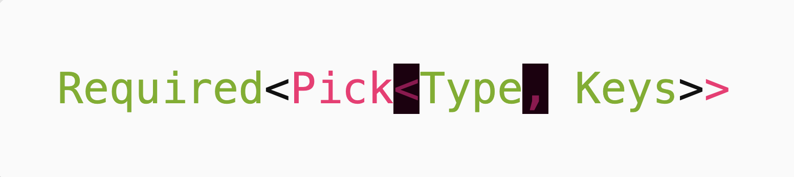

## Introducción
El otro día tuve una complicación queriendo escribir [este post sobre tipos útiles en TypeScript](../tipos-utiles-typescript/). En este artículo te narro mi travesía hacia la solución y mi falta de ganas por llevarla a cabo.

## Problema
Resulta que haciendo [dicho post](../tipos-utiles-typescript/) me topé con un problemilla. Al querer mostrar múltiples parámetros genéricos, se renderizaba una cosa horrible. Lo mismo sucedía cuando quería colocar como parámetro de un tipo a otro tipo con parámetros genéricos. Ejemplo:
```txt
Required<Pick<Type, Keys>>
```


Y dirás: ¡Pues bueno, usa otro tema de colores que haga que no se vea tan feo! **BUENO, SÍ, PERO NO**. No había seleccionado un tema a consciencia desde que creé mi blog, así que sí era hora de hacerlo. No obstante, solo estaría *tapando* el problema. Así que me propuse averiguar a qué se debía ese aparente error de sintaxis y qué era lo que podía hacer al respecto.

## Travesía
### Identificación del problema general
Lo primero es considerar que esta página web usa [Hugo](https://gohugo.io) para generar sus archivos estáticos (html, css, js, imágenes, etc.). Así que por ahí debía partir. Entonces fui directamente a la documentación y busqué información sobre el *highlighting* de código. No pasasron muchos segundos hasta que encontré que Hugo usa [Chroma](https://github.com/alecthomas/chroma) para poder renderizar el código en HTML con colores y sabores. Entonces, Chroma permite pasar de esto:
````perl
```javascript
const example = (...params) => {}
```
````
A esto:
```javascript
const example = (...params) => {}
```

¡Perfecto! En este punto, ya tenía una mejor idea de dónde podría empezar a buscar información relevante. Dado que Chroma es un proyecto bastante usado (más de 4300 estrellas en GitHub), era posible que la solución esté en algún *issue* en el repositorio. Pero no era el caso, ya que lo que encontré fue [el mismo error reportado](https://github.com/alecthomas/chroma/issues/425) *(recomiendo no leerlo hasta el final)* por otro usuario en noviembre de 2020, cuando ya era septiembre de 2024. Lamentablemente, no había una solución al problema en ese momento, mas [@alecthomas](https://github.com/alecthomas), quien se encarga de mantener el repo, había puesto dos etiquetas: `help wanted` y `lexer bug`.

### Identificación del problema específico
Intuyo que la información sobre qué es un lexer no es la más conocida por todo el mundo. Así que aquí va un hiperresumen: es un mecanismo que permite separar el código en tokens (elementos) de diversos tipos, como palabras reservadas, variables, números, símbolos, etc. Entonces, del ejemplo `const example = (...params) => {}` se podrían obtener, más o menos, tokens como los siguientes (ignorando los espacios):
1. `const`: palabra reservada
2. `example`: nombre
3. `=`: operador
4. `(`: puntuación
5. `...`: puntuación
6. `params`: nombre
7. `)`: puntuación
8. `=>`: operador
9. `{`: puntuación
10. `}`: puntuación 

Un uso típico que tienen los lexers es ser un paso previo a la compilación o interpretación del lenguaje, dado que es necesario poder hacer un *match* entre el código que se ha escrito y cómo este está siguiendo la sintaxis del lenguaje que ha usado. De esta manera, el compilador o intérprete, sabrá exactamente qué hacer con el código. Claro que en este caso, el lexer tiene como objetivo único poder obtener estos tokens con el objetivo de diferenciar los **tipos** de tokens mediante el uso de distintos colores y estilos.

Siguiendo esta línea, el lexer está detectando los símbolos `,` y `<` como errores sintácticos dentro del código escrito en TypeScript. Entonces, nos toca revisar el código del lexer de TypeScript de Chroma. Ya que el proyecto soporta muchísimos lenguajes, al analizar bien la estructura de directorios y la implementación del lexer, podremos tener una buena idea de cómo se estructuran los lexers en Chroma y cómo está implementado el de TypeScript en particular.

#### Lexers Chroma
Chroma usa lexers de forma 100% declarativa, en el sentido en que están escritos en XML y solo declaran una serie de reglas y estados que indican cómo se debería entrar o salir de cada uno de ellos. Aquí quiero mencionar que si bien el concepto de lexer es bastante estándar, la implementación puede ser bastante distinta entre un proyecto y otro. Así que veamos cómo se podría crear un lexer sencillísimo en Chroma. El lexer de ejemplo que haremos será para un lenguaje teórico en el que solo hay texto dentro y fuera de los paréntesis, además de paréntesis:
```xml
<lexer>
  <config>
    <name>Insiders</name>
  </config>
  <rules>
    <state name="root">
      <rule pattern="(">
        <token type="Punctuation" />
        <push state="inside" />
      </rule>
      <rule pattern=".+">
        <token type="NameOther" />
      </rule>
    </state>

    <state name="inside">
      <rule pattern=")">
        <token type="Punctuation" />
        <pop depth="1" />
      </rule>
      <rule pattern=".+">
        <token type="NameTag" />
      </rule>
    </state>
  </rules>
</lexer>
```

# WIP
Sigo editando este artículo. Luego publicaré la versión completa.