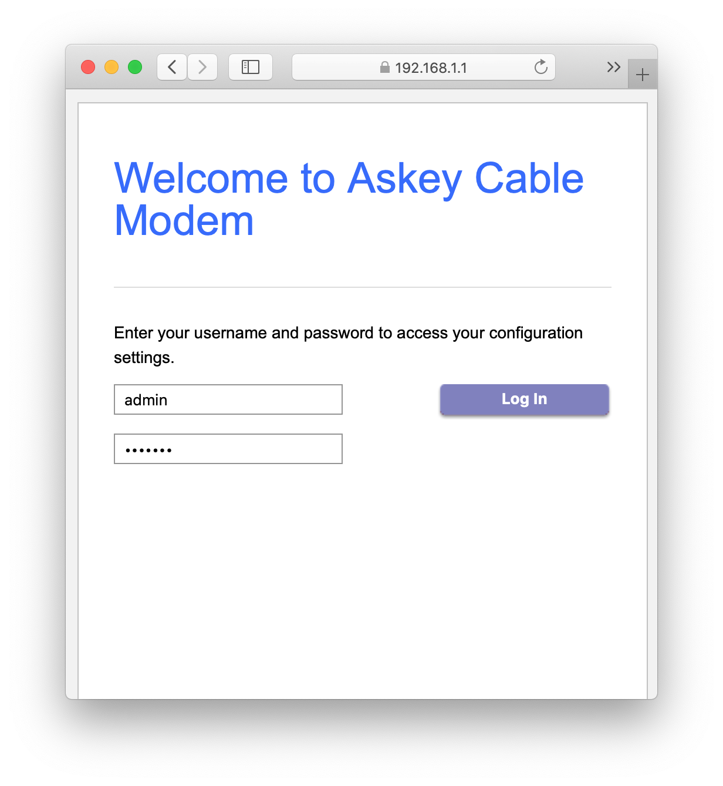
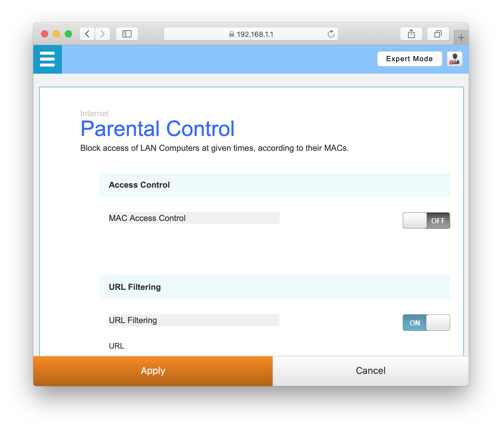
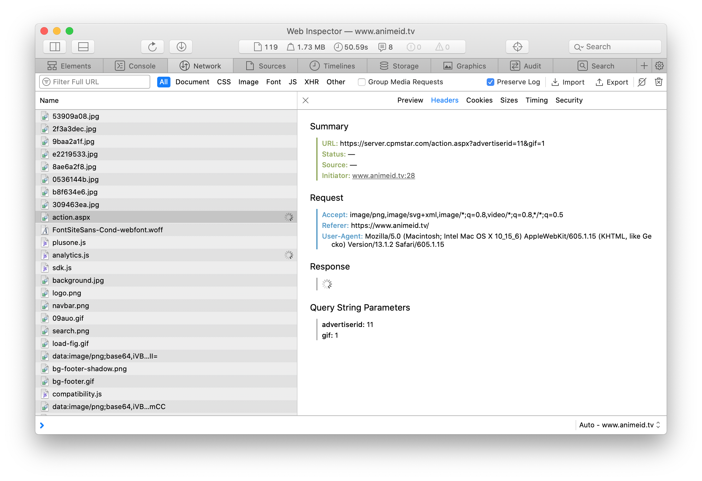
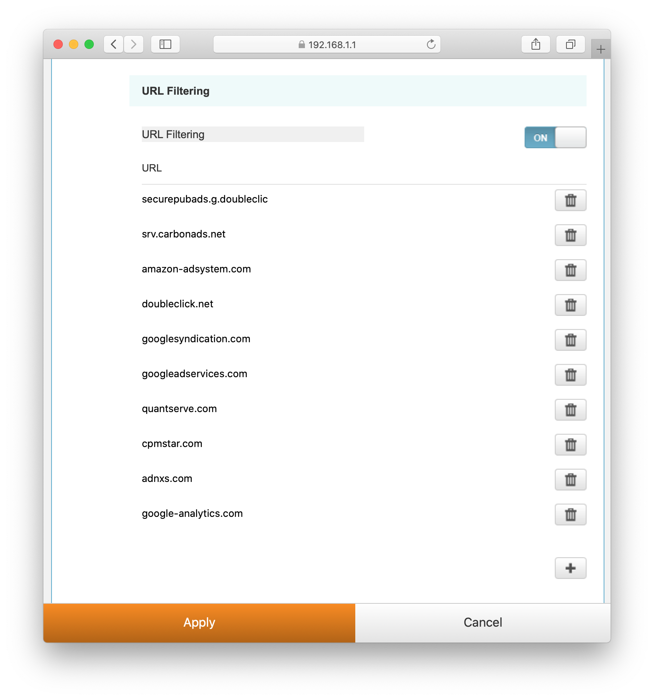

## Introducción
Ya sabes que las grandes compañías te espían hasta cuando duermes y saben más de tu vida que tú. Por eso te doy un tip que no se suele ver en internet sobre cómo hacer que te rastreen un poco menos.

### ¿Cuál es la diferencia con usar una extensión en tu navegador o en tu celular?
Sencillo. Esta solución no requiere ningún tipo de software adicional al que ya posees y se aplica de forma instantánea para todos los dispositivos de tu hogar.

### ¿La desventaja?
No tendrás esa misma privacidad cuando salgas de tu red y estés en la calle, por ejemplo. Si tienes una PC, no hay ningún problema. Si ese no es el caso, pos... *it is what it is*.

## Solución
Lo que harás el día de hoy será modificar una pequeña lista de control de acceso en tu *router* para poner en una lista prohibida los dominios que no te agraden. Lo que explicaré será lo que hice en mi casa. El proceso puede variar de acuerdo a tu ISP (*Internet Service Provider* o simplemente *Service Provider*), de forma que tendrás que indagar un poco para que te salga perfecto. Sin más, empecemos.

### Ingresar a la configuración parental
Con ayuda de nuestro navegador favorito, ingresamos al panel de control de nuestro *router*.

Luego me dirijo a las opciones de control parental. En mi caso, estaban ubicadas dentro de la categoría **Internet**. Una vez dentro, solo tengo que activar el filtrado por url.

### Identificar dominios indeseados
Los servicios de *ads* y *tracking* que encuentras en internet usan peticiones sencillas a sitios web para poder hacer el seguimiento. Estas peticiones suelen incluir *cookies* e información de la página que se está visitando. Para poder mandar estos datos, estas páginas tienen que contar con un dominio.

Ahora identificaremos esos dominios y bloquearemos la comunicación entre nuestra red y esos servidores. Para hacerlo, hay dos alternativas:
1. [Una lista de dominios hecha por alguien más](https://github.com/anudeepND/blacklist)
2. Una lista de acuerdo a los dominios que puedas identificar

Como se trata de un router casero, probablemente no tengas tanta flexibilidad como para bloquear cientos o decenas de miles de dominios, así que vayamos por los más comunes. Para hacerlo, puedes abrir las herramientas de desarrollador del navegador y entrar a una página que cargue muchos ads.

Entramos a la pestaña de *Network* y buscamos solicitudes que parezcan generadas por *trackers* o que tengan las palabras **track** o **ad** en el nombre.

En este log de red, podrás ver que se realizan muchas consultas a diversos recursos cuando cargas una página. Tendrás que verificar y aprender a diferenciar consultas por tipo para poder hacerlo con más rapidez. En mi caso, he encontrado una comunicación con el parámetro `advertiserid=11`, así que puedo ver muy fácilmente que se trata de un dominio indeseado para mí. También puedes usar el buscador que tiene incluida la herramienta para identificar estos sitios más rápidamente.

Con el análisis hecho, el primer dominio que bloquearé será `server.cpmstar.com`. Aunque de hecho, como al entrar al dominio base `cpmstar.com` veo que el riesgo de bloquear a todo el dominio no es muy grande, podría considerar `*.cpmstar.com` directamente, para también evitar las comunicaciones con subdominios de la misma empresa (no tengo nada en contra de cpmstar particularmente, por cierto jajajaja).

Es un trabajo manual, no te mentiré jajajaja. Si quisieras implementar soluciones de este tipo a gran escala, la solución sería usar un filtro a nivel de DNS o algún tipo de ACL. Este es un método casero y útil.

### Agregar los dominios indeseados al filtro parental
Si bien los controles parentales se crearon con otro fin, usarlos de esta manera no es tan descabellado. Nadie quiere que sigan a su descendencia por internet, ¿cierto?

Para cada router, la configuración puede ser un poco distinta, así que el bloqueo de todos los subdominios para tu equipo en particular puede ser `example.com`, en lugar de `*.example.com`. Aquí hay una captura de cómo está mi configuración actualmente.

Solo tengo que poner `Apply` luego de hacer algún cambio y listo. La comunicación no se llevará a cabo entre mi computadora y el dominio indeseado. Pueden ver que en la penúltima captura nunca cargó una respuesta en la comunicación con esa página, porque el router bloqueó la conexión.

Con eso, bloquearás una buena cantidad de anuncios y evitarás que te sigan un poco más que antes. Esta solución no es detectable por las páginas que detectan plugins como AdBlock, así que... pues está eso.